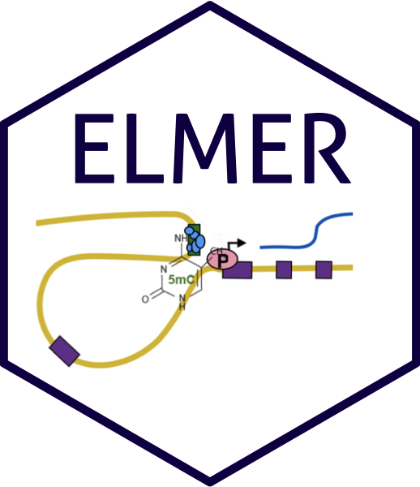

[](https://zenodo.org/badge/latestdoi/71802271)



### An R/Bioconductor Tool Inferring Regulatory Element Landscapes and Transcription Factor Networks Using Methylomes

#### Citing ELMER


Tiago C Silva, Simon G Coetzee, Nicole Gull, Lijing Yao, Dennis J Hazelett, Houtan Noushmehr, De-Chen Lin, Benjamin P Berman; ELMER v.2: an R/Bioconductor package to reconstruct gene regulatory networks from DNA methylation and transcriptome profiles, Bioinformatics, , bty902, https://doi.org/10.1093/bioinformatics/bty902

#### Main article 
https://doi.org/10.1093/bioinformatics/bty902


#### Installing and loading ELMER
To obtain a copy of ELMER, you will need to install devtools and ELMER.data which contains essential data for running ELMER package 

```r
install.packages(devtools)
library(devtools);
devtools::install_github("tiagochst/ELMER.data");
devtools::install_github("tiagochst/ELMER");
```

#### Documentation
* [ELMER documentation](https://bioconductor.org/packages/devel/bioc/vignettes/ELMER/inst/doc/index.html)
* [ELMER.data documentation](https://tiagochst.github.io/ELMER.data/index.nb.html)
* [Paper supplemental files](https://tiagochst.github.io/ELMER_supplemental/)


