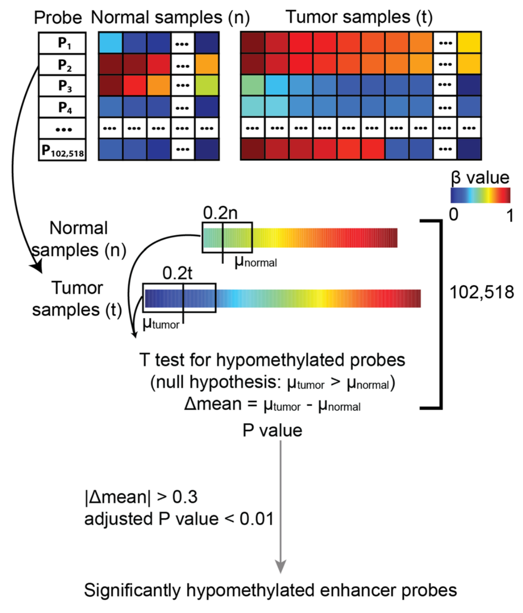

# Identifying differentially methylated probes

This step is to identify DNA methylation changes at distal enhancer probes which is
carried out by function `get.diff.meth`.

For each distal probe, the function first rank samples from group 1 and group 2 samples by their DNA methylation beta values. 
To identify hypomethylated probes, the function compared the lower control quintile (20\% of control samples with the lowest methylation) 
to the lower experiment quintile (20\% of experiment samples with the lowest methylation), using an unpaired one-tailed t-test.

 [@yao2015inferring,@yao2015demystifying]


<div class="panel panel-info">
<div class="panel-heading">Main get.diff.meth arguments </div>
<div class="panel-body">
| Argument | Description |
|------------|--------------------------------------------------------------------------------------------------------------------------------------------------------------------------------------------------------------------------------------------------------------------------------------------------------------|
| data | A `multiAssayExperiment` with DNA methylation and Gene Expression data. See `createMAE` function. |
| diff.dir |  A character can be "hypo" or "hyper", showing differential methylation dirction.  It can be "hypo" which is only selecting hypomethylated probes;  "hyper" which is only selecting hypermethylated probes |
| minSubgroupFrac |  A number ranging from 0 to 1,specifying the fraction of extreme samples from group 1 and group 2  that are used to identify the differential DNA methylation.  The default is 0.2 because we typically want to be able to detect a specific (possibly unknown) molecular subtype among tumor; these subtypes often make up only a minority of samples, and 20\% was chosen as a lower bound for the purposes of statistical power. If you are using pre-defined group labels, such as treated replicates vs. untreated replicated, use a value of 1.0 (***Supervised*** mode) |
| pvalue | A number specifies the significant P value (adjusted P value by BH) cutoff for selecting significant hypo/hyper-methylated probes. Default is 0.01 |
| group.col | A column defining the groups of the sample. You can view the available columns using: `colnames(MultiAssayExperiment::colData(data))`. |
| group1 | A group from group.col. ELMER will run group1 vs group2. That means, if direction is hyper, get probes hypermethylated in group 1 compared to group 2. |
| group2 | A group from group.col. ELMER will run group1 vs group2. That means, if direction is hyper, get probes hypermethylated in group 1 compared to group 2. |
| sig.dif | A number specifies the smallest DNA methylation difference as a cutoff for selecting significant hypo/hyper-methylated probes. Default is 0.3. |
</div>
</div>

```{r,eval=TRUE, message=FALSE, warning = FALSE, results = "hide"}
mae <- get(load("mae.rda"))
sig.diff <- get.diff.meth(data = mae, 
                          group.col = "definition",
                          group1 =  "Primary solid Tumor",
                          group2 = "Solid Tissue Normal",
                          minSubgroupFrac = 0.2,
                          sig.dif = 0.3,
                          diff.dir = "hypo", # Search for hypomethylated probes in group 1
                          cores = 1, 
                          dir.out ="result", 
                          pvalue = 0.01)
```

```{r,eval=TRUE, message=FALSE, warning = FALSE}
head(sig.diff)  %>% datatable(options = list(scrollX = TRUE))
# get.diff.meth automatically save output files. 
# getMethdiff.hypo.probes.csv contains statistics for all the probes.
# getMethdiff.hypo.probes.significant.csv contains only the significant probes which
# is the same with sig.diff
dir(path = "result", pattern = "getMethdiff")  
```

# Bibliography
