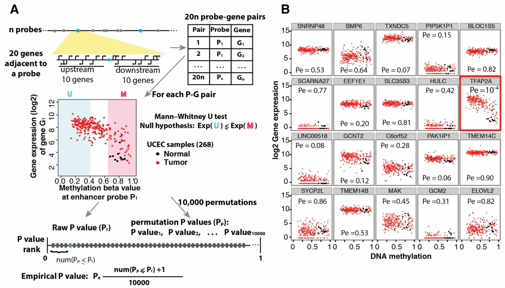

```{r, echo = FALSE,hide=TRUE, message=FALSE, warning=FALSE}
library(ELMER)
library(DT)
library(dplyr)
library(BiocStyle)
```

<br>

# Identifying putative probe-gene pairs

## Introduction
This step is links distal probes with methylation changes to target genes with expression
changes and report the putative target gene for selected probes. This is carried out
by function `get.pair`. 


## Description
For each differentially methylated distal probe (DMC), the closest 10 upstream genes and the closest 10 downstream genes are tested for inverse correlation between methylation of the probe and expression of the gene, which is the same basic strategy employed in ELMER version 1. However, we now import all gene annotations programmatically using the Biomart [@durinck2005biomart] package. This allows easy extensibility to use any annotations desired (our default uses Ensembl annotations).

This step also differs between the `Supervised` and `Unsupervised` modes. In the `Unsupervised` mode, as in ELMER 1.0, for each probe-gene pair, the samples (all samples from both groups) are divided into two groups: the $M$ group, which consist of the upper methylation quintile (the 20\%of samples with the highest methylation at the enhancer probe), and the $U$ group, 
which consists of the lowest methylation quintile (the 20\% of samples with the 
lowest methylation). In the new `Supervised` mode, the $U$ and $M$ groups are defined strictly by sample group labels, and all samples in each group are used. 
For each differentially methylated distal probe (DMC), the closest 10 upstream 
genes and the closest 10 downstream genes are tested for inverse correlation between 
methylation of the probe and expression of the gene (the number 10 can be changed using the `numFlankingGenes` parameter). To select these genes, 
the probe-gene distance is defined as the distance from the probe to the transcription 
start site specified by the ENSEMBL gene level annotations [@yates2015ensembl] accessed via
the R/Bioconductor package biomaRt [@durinck2009mapping,@durinck2005biomart]. By choosing a constant number of genes to test for each probe, our goal is to avoid systematic false positives for probes in gene rich regions. This is especially important given the highly non-uniform gene density of mammalian genomes.

Thus, exactly 20 statistical tests were performed for each probe, as follows. 

For each candidate probe-gene pair, 
the Mann-Whitney U test is used to test the null hypothesis that overall gene 
expression in group $M$ is greater than or equal than that in group $U$. 
This non-parametric test was used in order to minimize the effects 
of expression outliers, which can  occur across a very wide dynamic range. 
In the `unsupervised mode` for each probe-gene pair tested, the raw p-value $P_r$ is corrected for multiple 
hypothesis using a permutation approach as follows.
The gene in the pair is held constant, and `x` random methylation probes are 
chosen to perform the same one-tailed U test, generating a set of `x` permutation
p-values $P_p$. We chose the x random probes only from among those that were 
"distal" (farther than $2kb$ from an annotated transcription start site), in order 
to draw these null-model probes from the same set as the probe being tested [@sham2014statistical]. 
An empirical p-value $P_e$ value was calculated using the following formula 
(which introduces a pseudo-count of 1):

\begin{equation}
P_e = \frac{num(P_p \leq P_r)+ 1}{x+1}
\end{equation}

In the `unsupervised mode` for each probe-gene pair tested, the raw p-value $P_r$ is corrected for multiple 
hypothesis using Benjamini-Hochberg Procedure.

Notice that in the `Supervised` mode, no additional filtering is necessary to ensure that the $M$ and $U$ group segregate by sample group labels.  The two sample groups are segregated by definition, since these probes were selected for their differential methylation, with the same directionality, between the two groups. 


 [@yao2015inferring]


# Function arguments

<div class="panel panel-info">
<div class="panel-heading">Main get.pair arguments </div>
<div class="panel-body">
| Argument          | Description                                                                                                                                                                                                                                                                                                                                                         |
|-------------------|---------------------------------------------------------------------------------------------------------------------------------------------------------------------------------------------------------------------------------------------------------------------------------------------------------------------------------------------------------------------|
| data              | A multiAssayExperiment with DNA methylation and Gene Expression data. See createMAE function.                                                                                                                                                                                                                                                                       |
| nearGenes         | Can be either a list containing output of GetNearGenes function or path of rda file containing output of `GetNearGenes` function.                                                                                                                                                                                                                                     |
| minSubgroupFrac        | A number ranging from 0 to 1.0 specifying the percentage of samples used to create groups U (unmethylated) and M (methylated) used to link probes to genes. Default is 0.4 (lowest quintile samples will be in the U group and the highest quintile samples in the M group).                                                                                                                                                                                                                                             |
| permu.size        | A number specify the times of permuation. Default is 10000.                                                                                                                                                                                                                                                                                                         |
| raw.pvalue            | A number specify the raw p-value cutoff for defining signficant pairs. Default is 0.05. It will select the significant P value cutoff before calculating the empirical p-values.                                                                                                                                                           |
| Pe                | A number specify the empirical p-value cutoff for defining signficant pairs. Default is 0.001.                                                                                                                                                                                                                        |
| group.col         | A column defining the groups of the sample. You can view the available columns using: `colnames(MultiAssayExperiment::colData(data))`.                                               |
| group1 | A group from group.col. |
| group2 | A group from group.col. |
| mode	|A character. Can be "unsupervised" or "supervised". If unsupervised is set the U (unmethylated) and M (methylated) groups will be selected among all samples based on methylation of each probe. Otherwise U group and M group will set as the samples of group1 or group2 as described below: If diff.dir is "hypo, U will be the group 1 and M the group2. If diff.dir is "hyper" M group will be the group1 and U the group2.|
| diff.dir	| A character can be "hypo" or "hyper", showing differential methylation dirction in group 1. It can be "hypo" which means the probes are hypomethylated in group1; "hyper" which means the probes are hypermethylated in group1; This argument is used only when mode is supervised nad it should be the same value from get.diff.meth function. |
| filter.probes     | Should filter probes by selecting only probes that have at least a certain number of samples below and above a certain cut-off. See `preAssociationProbeFiltering` function.                                                                                                                                                                                          |
| filter.portion    | A number specify the cut point to define binary methlation level for probe loci. Default is 0.3. When beta value is above 0.3, the probe is methylated and vice versa. For one probe, the percentage of methylated and unmethylated samples should be above filter.percentage value. Only used if filter.probes is TRUE. See preAssociationProbeFiltering function. |
| filter.percentage | Minimum percentage of samples to be considered in methylated and unmethylated for the filter.portion option. Default 5%. Only used if filter.probes is TRUE. See preAssociationProbeFiltering function.   |
</div>
</div>

# Example of use
```{r, eval = TRUE, message = FALSE, warning = FALSE, results = "hide"}
# Load results from previous sections
mae <- get(load("mae.rda"))
sig.diff <- read.csv("result/getMethdiff.hypo.probes.significant.csv")

nearGenes <- GetNearGenes(data = mae, 
                         probes = sig.diff$probe, 
                         numFlankingGenes = 20) # 10 upstream and 10 dowstream genes

Hypo.pair <- get.pair(data = mae,
                      group.col = "definition",
                      group1 =  "Primary solid Tumor",
                      group2 = "Solid Tissue Normal",
                      nearGenes = nearGenes,
                      mode = "unsupervised",
                      permu.dir = "result/permu",
                      permu.size = 100, # Please set to 100000 to get significant results
                      raw.pvalue = 0.05,   
                      Pe = 0.01, # Please set to 0.001 to get significant results
                      filter.probes = TRUE, # See preAssociationProbeFiltering function
                      filter.percentage = 0.05,
                      filter.portion = 0.3,
                      dir.out = "result",
                      cores = 1,
                      label = "hypo")
```

Observation: The distance column in the nearGenes object and in thable getPair.hypo.all.pairs.statistic.csv  are the distance to the gene. 
To update, to the distance to the nearest TSS please use the function `addDistNearestTSS`.
This function was not used default  due to time requirements to run for all probes and all their 20 nearest genes, but it is ran for the significant pairs.

```{r, eval = TRUE, message = FALSE, warning = FALSE}
Hypo.pair %>% datatable(options = list(scrollX = TRUE))
# get.pair automatically save output files. 
# getPair.hypo.all.pairs.statistic.csv contains statistics for all the probe-gene pairs.
# getPair.hypo.pairs.significant.csv contains only the significant probes which is 
# same with Hypo.pair.
dir(path = "result", pattern = "getPair") 
```

# Bibliography
