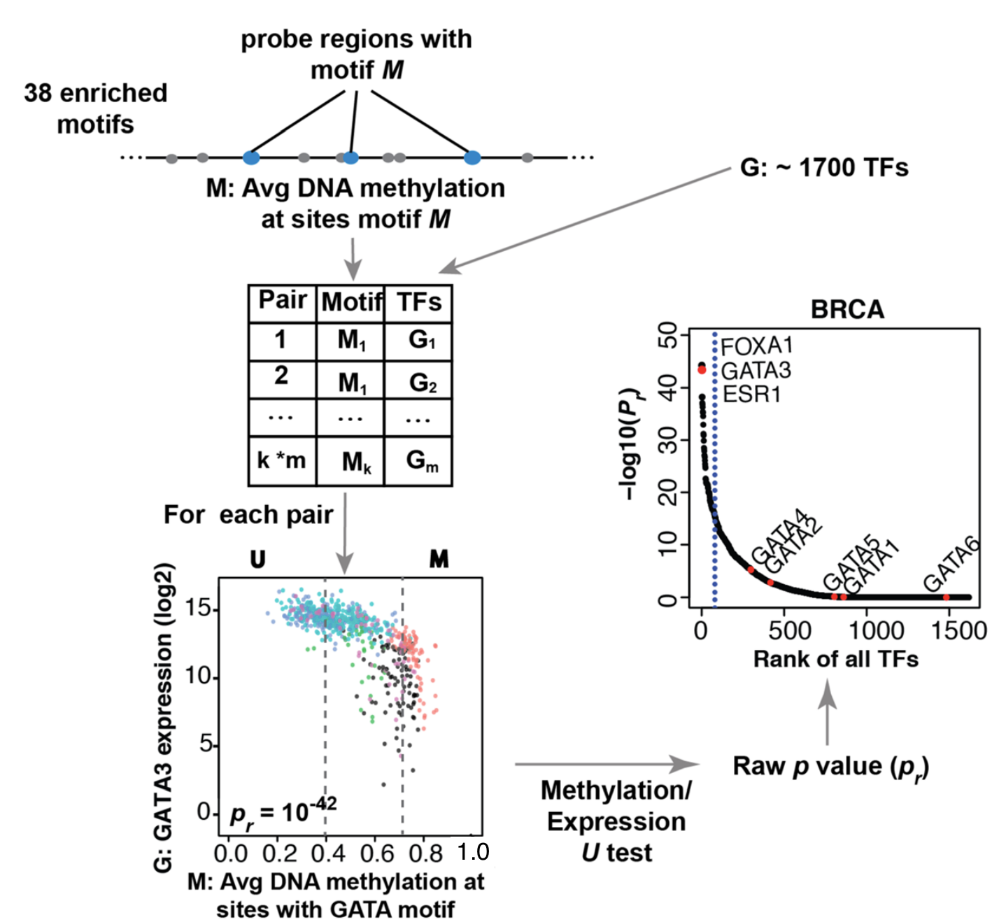

# Analysis
## Identifying regulatory TFs


This step is to identify regulatory TF whose expression associates with TF binding motif 
DNA methylation which is carried out by function `get.TFs`.

For each motif considered to be enriched within a particular probe set, it will
compare the average DNA methylation at all distal enhancer probes within $\pm250bp$  
of a motif occurrence, to the expression of human TFs. A statistical test 
was performed for each motif-TF pair, as follows. The samples (all groups samples) 
were divided into two groups: the M group, which consisted 
of the 20\% of samples with the highest average methylation at all motif-adjacent 
probes, and the U group, which consisted of the 20\% of samples with the lowest 
methylation. For each candidate motif-TF pair, the Mann-Whitney U test was used to test 
the null hypothesis that overall gene expression in group M was greater or equal 
than that in group U.
All TFs were ranked by the $-log_{10}(P_{r})$, and those falling within the top 5% of 
this ranking were considered candidate upstream regulators. 

 [@yao2015inferring,@yao2015demystifying]

<div class="panel panel-info">
<div class="panel-heading">Main get.pair arguments </div>
<div class="panel-body">
| Argument | Description |
|--------------------|----------------------------------------------------------------------------------------------------------------------------------------------------------------------------------------------------------------------------------------------------------------------------------|
| data | A multiAssayExperiment with DNA methylation and Gene Expression data. See `createMAE` function. |
| enriched.motif | A list containing output of get.enriched.motif function or a path of XX.rda file containing output of get.enriched.motif function. |
| group.col         | A column defining the groups of the sample. You can view the available columns using: `colnames(MultiAssayExperiment::colData(data))`.                
| group1 | A group from group.col. |
| group2 | A group from group.col. |
| minSubgroupFrac |  A number ranging from 0 to 1 specifying the percentage of samples used to create the groups U (unmethylated)  and M (methylated) used to link probes to TF expression.  Default is 0.4 (lowest quintile of all samples will be in the  U group and the highest quintile of all samples in the M group). |
</div>
</div>


```{r,eval=TRUE, message=FALSE, warning = FALSE, results = "hide"}
# Load results from previous sections
mae <- get(load("mae.rda"))
load("result/getMotif.hypo.enriched.motifs.rda")

## identify regulatory TF for the enriched motifs
TF <- get.TFs(data = mae, 
              group.col = "definition",
              group1 =  "Primary solid Tumor",
              group2 = "Solid Tissue Normal",
              minSubgroupFrac = 0.4,
              enriched.motif = enriched.motif,
              dir.out = "result", 
              cores = 1, 
              label = "hypo")
```

```{r,eval=TRUE, message=FALSE, warning = FALSE}
# get.TFs automatically save output files. 
# getTF.hypo.TFs.with.motif.pvalue.rda contains statistics for all TF with average 
# DNA methylation at sites with the enriched motif.
# getTF.hypo.significant.TFs.with.motif.summary.csv contains only the significant probes.
dir(path = "result", pattern = "getTF")  

# TF ranking plot based on statistics will be automatically generated.
dir(path = "result/TFrankPlot_family/", pattern = "pdf") 
```

# Bibliography
