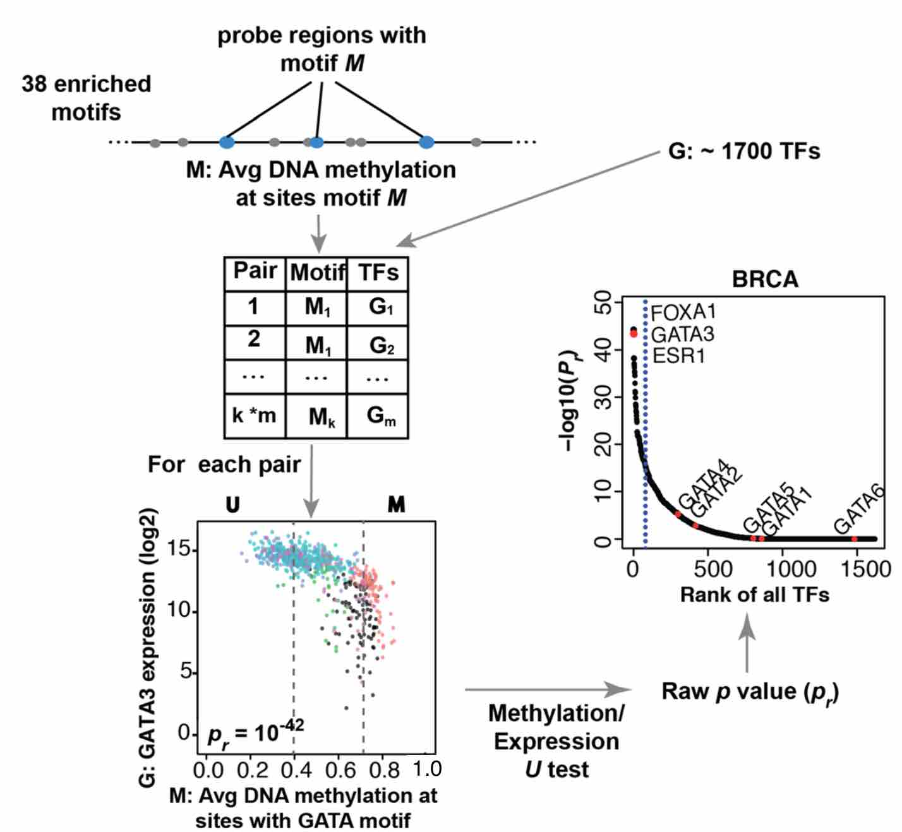

<br>

# Identification of master regulator TFs


## Introduction
This step identifies regulatory TF whose expression associates with TF binding motif 
DNA methylation and it is carried out by function `get.TFs`.

## Description

When a group of enhancers is coordinately altered in a specific sample subset, this is often the result of an altered upstream **master regulator** transcription factor in the gene regulatory network. ELMER identifies master regulator TFs corresponding to each of the TF binding motifs enriched from the previous analysis step.
For each enriched motif, ELMER takes the mean DNA methylation of all distal probes (in significant probe-gene pairs) that contain that motif occurrence (within a $\pm 250bp$ region) and compares this mean DNA methylation to the expression of each gene annotated as a human TF. 


In the `Unsupervised` mode, a statistical test is performed for each motif-TF pair, as follows. All samples 
are divided into two groups: the $M$ group, which consists 
of the 20\% of samples with the highest average methylation at all motif-adjacent
probes, and the $U$ group, which consisted of the 20\%  of samples with the lowest 
methylation. This step is performed by the `get.TFs` function, which takes `minSubgroupFrac` as an input parameter, again with a default of 20\%.
For each candidate motif-TF pair, the Mann-Whitney U test is used to test 
the null hypothesis that overall gene expression in group $M$ is greater or equal 
than that in group $U$. This non-parametric test was used in order to minimize the 
effects of expression outliers, which can occur across a very wide dynamic range. 
For each motif tested, this results in a raw p-value ($P_r$) for each of the human TFs.

The new `Supervised`  mode uses the same approach as described for the identification of putative target gene(s) step. The $U$ and $M$ groups are one of the the label group of samples and the `minSubgroupFrac` parameter is set to 100\% to use all samples from both groups in the statistical test. This also can result in greater statistical power when using the `Supervised` mode.


Finally, all TFs were ranked by the $-log_{10}(P_{r})$, and those falling within the top 5\% of 
this ranking were considered candidate upstream regulators. 
By default, the top 3 most anti-correlated TFs, and all TF classified by TFClass database in the same (sub)family are highlighted.


 [@yao2015inferring,@yao2015demystifying]


# Function arguments
<div class="panel panel-info">
<div class="panel-heading">Main get.pair arguments </div>
<div class="panel-body">
| Argument | Description |
|--------------------|----------------------------------------------------------------------------------------------------------------------------------------------------------------------------------------------------------------------------------------------------------------------------------|
| data | A multiAssayExperiment with DNA methylation and Gene Expression data. See `createMAE` function. |
| enriched.motif | A list containing output of get.enriched.motif function or a path of XX.rda file containing output of get.enriched.motif function. |
| group.col         | A column defining the groups of the sample. You can view the available columns using: `colnames(MultiAssayExperiment::colData(data))`.                
| group1 | A group from group.col. |
| group2 | A group from group.col. |
| minSubgroupFrac |  A number ranging from 0 to 1 specifying the percentage of samples used to create the groups U (unmethylated)  and M (methylated) used to link probes to TF expression.  Default is 0.4 (lowest quintile of all samples will be in the  U group and the highest quintile of all samples in the M group). |
| mode	 | A character. Can be "unsupervised" or "supervised". If unsupervised is set the U (unmethylated) and M (methylated) groups will be selected among all samples based on methylation of each probe. Otherwise U group and M group will set as the samples of group1 or group2 as described below: If diff.dir is "hypo, U will be the group 1 and M the group2. If diff.dir is "hyper" M group will be the group1 and U the group2. |
| diff.dir	 | A character can be "hypo" or "hyper", showing differential methylation dirction in group 1. It can be "hypo" which means the probes are hypomethylated in group1; "hyper" which means the probes are hypermethylated in group1; This argument is used only when mode is supervised nad it should be the same value from get.diff.meth function. | 
</div>
</div>


# Example of use
```{r,eval=TRUE, message=FALSE, warning = FALSE, results = "hide"}
# Load results from previous sections
mae <- get(load("mae.rda"))
load("result/getMotif.hypo.enriched.motifs.rda")
```

```{r,eval=TRUE, message=FALSE, warning = FALSE, results = "hide"}
## identify regulatory TF for the enriched motifs
TF <- get.TFs(data = mae, 
              group.col = "definition",
              group1 =  "Primary solid Tumor",
              group2 = "Solid Tissue Normal",
              mode = "unsupervised",
              enriched.motif = enriched.motif,
              dir.out = "result", 
              cores = 1, 
              label = "hypo")
```

```{r,eval=TRUE, message=FALSE, warning = FALSE}
# get.TFs automatically save output files. 
# getTF.hypo.TFs.with.motif.pvalue.rda contains statistics for all TF with average 
# DNA methylation at sites with the enriched motif.
# getTF.hypo.significant.TFs.with.motif.summary.csv contains only the significant probes.
dir(path = "result", pattern = "getTF")  

# TF ranking plot based on statistics will be automatically generated.
dir(path = "result/TFrankPlot/", pattern = "pdf") 
```

# Bibliography
